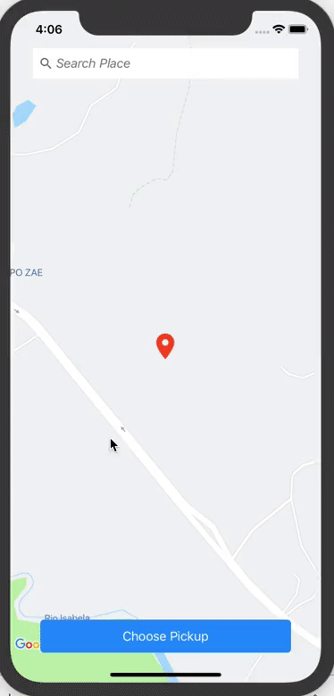
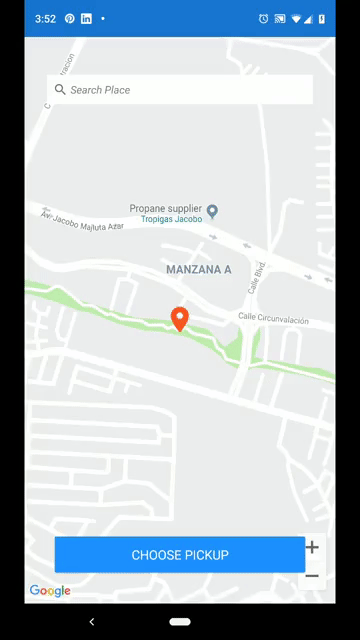

# Map Tracking Sample
Map Tracking Sample in Xamarin Forms

&nbsp;&nbsp;&nbsp;&nbsp;&nbsp;&nbsp;&nbsp;

Blog post: [Exploring Map Tracking UI in Xamarin Forms](http://www.xamboy.com/2019/05/17/exploring-map-tracking-ui-in-xamarin-forms/)

Search Place Sample in Xamarin Forms

&nbsp;&nbsp;&nbsp;&nbsp;&nbsp;&nbsp;&nbsp;

Blog post: [Google Maps Place Search in Xamarin Forms](http://www.xamboy.com/2019/05/29/google-maps-place-search-in-xamarin-forms/)

Setting pickup location marker using Google Maps in Xamarin Forms

&nbsp;&nbsp;&nbsp;&nbsp;&nbsp;&nbsp;&nbsp;

Blog post: [Setting pickup location marker using Google Maps in Xamarin Forms](http://www.xamboy.com/2019/06/05/setting-pickup-location-marker-using-google-maps-in-xamarin-forms/)
