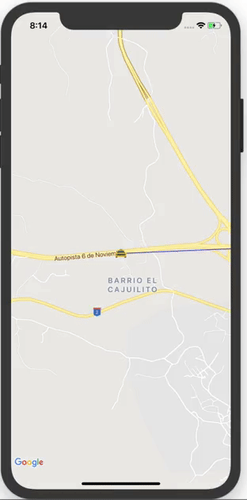
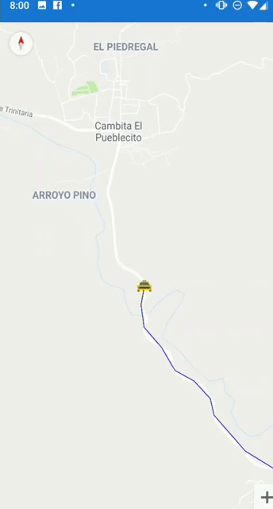
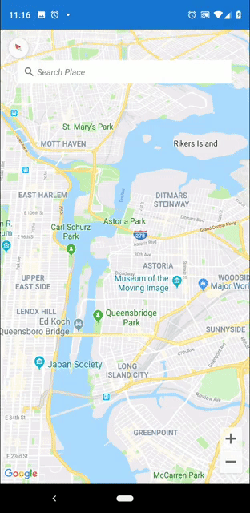

# Map Tracking Sample
Map Tracking Sample in Xamarin Forms

&nbsp;&nbsp;&nbsp;&nbsp;&nbsp;&nbsp;&nbsp;

Blog post: [Exploring Map Tracking UI in Xamarin Forms](http://www.xamboy.com/2019/05/17/exploring-map-tracking-ui-in-xamarin-forms/)

Search Place Sample in Xamarin Forms

&nbsp;&nbsp;&nbsp;&nbsp;&nbsp;&nbsp;&nbsp;

Blog post: [Place Searches in Google Maps on Xamarin Forms](http://www.xamboy.com)

